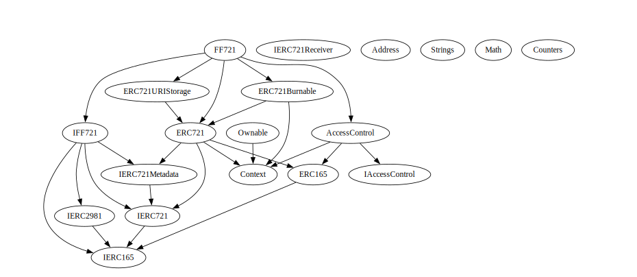

# FF721 - An OpenSea compatible NFT that supports ERC2891 royalites

## Introduction
The FF721 is an NFT that supports royalties. It is based on the ERC721 standard, but with a few changes to support the IERC2981 standard as well as a methods to support royalties on Open Sea. The FF721 was built with with a few real world NFTs in mind - no JPEGs. Usually these use cases have some foot in the real world allowing owners of this NFT to burn the token in return for the real world asset reprented by the NFT. As such, there is always going to be a form of trust in the issuer of this token and the centralised aspects of this contract should be looked at through this lense. 

All this being said, there are ways to use this contract in a fully trustless manner.

The FF721 uses Open Zeppelin's AccessControl contract to manage roles. The following roles are defined:
- MINTER_ROLE - The role that can mint new tokens
- SETTER_ROLE - The role that can set the baseTokenURI, contractURI and tokenURI
- BURNER_ROLE - The role that can burn tokens

## Getting Started

### Set Variables

There are 6 variables that need to be set in the contracts/FF721.sol file. 

These are: _name, _symbol, _baseTokenURI, _contractURI, _royaltyReceiver and _royaltyBasisPoint.

All the variables, except for _name and _symbol, can be changed after deployment. Example values for these variables are provided below.

```solidity
string private constant _name = "FanFire 721";
string private constant _symbol = "FF721";
string private _baseTokenURI = "https://raw.githubusercontent.com/fan-fire/ff721/main/assets/jsons/";
string private _contractURI ="https://raw.githubusercontent.com/fan-fire/ff721/main/assets/jsons/collection.json";
address private _royaltyReceiver = 0xFdD72142CA8cE7dC492cDe17557c16d8cbc17c1B;
uint256 private _royaltyBasisPoint = 1000;
```

### Deploy and test locally
Clone the project 
```bash
git clone https://github.com/fan-fire/ff721.git
```

Run the tests
```
npx hardhat test
```

### Deploying to a Testnet

## Tools

+ The best solidity VS Code extension - https://marketplace.visualstudio.com/items?itemName=tintinweb.solidity-visual-auditor


## Overview



### IFF721

|     Method      | Description |
| :-------------: | :---------- |
|      mint       |             |
|      burn       |             |
|  setRoyalties   |             |
| setBaseTokenURI |             |
| setContractURI  |             |
|   setTokenURI   |             |
|  baseTokenURI   |             |
|   contractURI   |             |
| currentTokenId  |             |

### FF721

| Contract  |       Type        |                              Bases                              |                |               |
| :-------: | :---------------: | :-------------------------------------------------------------: | :------------: | :-----------: |
|     └     | **Function Name** |                         **Visibility**                          | **Mutability** | **Modifiers** |
|           |                   |                                                                 |                |               |
| **FF721** |  Implementation   | IFF721, ERC721, ERC721URIStorage, ERC721Burnable, AccessControl |                |               |
|     └     |    Constructor    |                            Public ❗️                             |       🛑        |    ERC721     |
|     └     |       mint        |                            Public ❗️                             |       🛑        |   onlyRole    |
|     └     |       burn        |                            Public ❗️                             |       🛑        |   onlyRole    |
|     └     |   setRoyalties    |                           External ❗️                            |       🛑        |   onlyRole    |
|     └     |  setBaseTokenURI  |                            Public ❗️                             |       🛑        |   onlyRole    |
|     └     |  setContractURI   |                            Public ❗️                             |       🛑        |   onlyRole    |
|     └     |    setTokenURI    |                            Public ❗️                             |       🛑        |   onlyRole    |
|     └     |     tokenURI      |                            Public ❗️                             |                |      NO❗️      |
|     └     |     _baseURI      |                           Internal 🔒                            |                |               |
|     └     |   baseTokenURI    |                            Public ❗️                             |                |      NO❗️      |
|     └     |    contractURI    |                            Public ❗️                             |                |      NO❗️      |
|     └     |    royaltyInfo    |                           External ❗️                            |                |      NO❗️      |
|     └     |  currentTokenId   |                            Public ❗️                             |                |      NO❗️      |
|     └     | supportsInterface |                            Public ❗️                             |                |      NO❗️      |
|     └     |       _burn       |                           Internal 🔒                            |       🛑        |               |
|     └     |   _setRoyalties   |                           Internal 🔒                            |       🛑        |               |
|           |                   |                                                                 |                |               |

## Contract Augmentations

## Additions 

## Caveats

## Royalties
// Required by opensea according to https://docs.opensea.io/docs/1-structuring-your-smart-contract
// Required by opensea for storefront metadata https://docs.opensea.io/docs/contract-level-metadata

## Gas Usage

```
REPORT_GAS=true npx hardhat test
```

## 